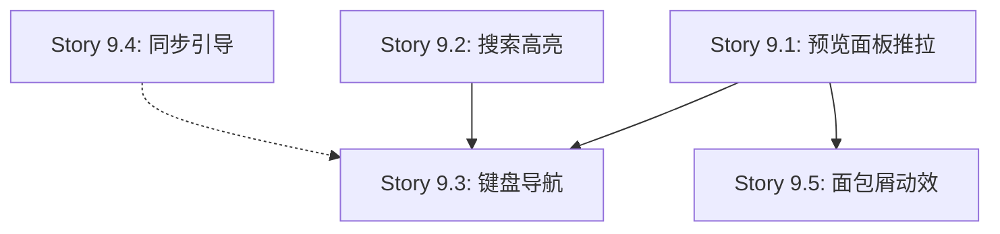

---
stepsCompleted:
  [
    "step-01-validate-prerequisites",
    "step-02-design-epics",
    "step-03-create-stories",
    "step-04-final-validation",
  ]
inputDocuments:
  - "prd-ux-interaction-optimization.md"
  - "ux-design-specification-interaction-optimization.md"
  - "architecture-interaction-optimization.md"
  - "epics.md"
type: 'epic-supplement'
status: 'approved'
date: '2026-04-15'
---

# Epic 9: 交互体验优化 — 预览面板、搜索高亮、键盘导航、同步引导、过渡动效

## Overview

本 Epic 基于代码实现与 UX 规范差距分析，将五条高价值交互优化提案拆解为可执行的 Story。覆盖预览面板智能推拉、搜索高亮与 Command Palette 联动、键盘导航补全、同步流程渐进引导、面包屑与过渡动效五个方向。

**FRs covered:** FR-UX-01 ~ FR-UX-20
**NFRs covered:** NFR-UX-01 ~ NFR-UX-05
**来源 PRD:** prd-ux-interaction-optimization.md
**来源 UX 规范:** ux-design-specification-interaction-optimization.md
**来源架构:** architecture-interaction-optimization.md (AD-41 ~ AD-47)
**依赖:** Epic 1（Skill 浏览基础）、Epic 4（IDE 同步基础）、Epic 6（UX 优化基础）

---

## Epic 9: 交互体验优化

### Story 9.1: 预览面板智能推拉式

As a 用户,
I want 预览面板根据屏幕宽度自动切换 push/overlay 模式，点击卡片时平滑推入预览内容而非跳转页面,
So that 我可以在浏览 Skill 列表的同时无缝查看 Skill 详情，不丢失列表上下文。

**Acceptance Criteria:**

**Given** 浏览器窗口宽度 ≥ 1440px (Wide 断点)
**When** 用户进入 Skill 浏览页
**Then** 预览面板常驻显示在右侧（400px 宽），主内容区自动适配三栏布局
**And** 预览面板显示最后选中或第一个 Skill 的内容

**Given** 浏览器窗口宽度在 1024-1439px (Standard 断点)
**When** 用户点击一张 Skill 卡片
**Then** 预览面板从右侧 push 推入（360px 宽），主内容区宽度自动收缩
**And** 推入动画为 `translateX(0)` 200ms ease-in-out

**Given** 浏览器窗口宽度在 1024-1439px (Standard 断点)
**When** 用户点击关闭按钮或按 Escape
**Then** 预览面板向右滑出，主内容区恢复原宽度
**And** 滑出动画为 `translateX(100%)` 200ms ease-in-out

**Given** 浏览器窗口宽度 < 1024px (Compact 断点)
**When** 用户点击一张 Skill 卡片
**Then** 预览面板以 overlay 模式从右侧滑入覆盖主内容区（100% 宽度，z-index: 50）
**And** 滑入动画为 250ms ease-in-out

**Given** 预览面板打开且显示某个 Skill
**When** 用户点击另一张 Skill 卡片
**Then** 预览面板内容切换为新 Skill，面板不关闭
**And** 内容切换有 opacity 1→0.3→1 过渡（150ms）

**Given** 用户在 Standard/Compact 断点
**When** 按 `⌘\` 快捷键
**Then** 切换预览面板的显示/隐藏状态

**Given** 系统设置了 `prefers-reduced-motion`
**When** 预览面板执行任何动画
**Then** 所有动画降级为无动画（瞬间切换）

**Given** 本 Story 完成
**When** 运行测试
**Then** `getPreviewMode()` 函数有单元测试（覆盖三个断点）
**And** SkillBrowsePage 在 Standard 断点下的 push 行为有集成测试
**And** Compact 断点下的 overlay 行为有集成测试
**And** 所有测试通过

**Technical Notes:**

- 使用 `ResizeObserver` 监听容器宽度变化，不使用 `window.resize` 事件
- 新增 CSS 变量：`--preview-panel-width`（400px/360px）、`--preview-transition-duration`（200ms）
- 主内容区宽度使用 CSS `calc()` 计算，预览面板使用 CSS `transform: translateX()` 动画
- 参考 AD-41 架构决策
- 参考 UX 规范增补 1

---

### Story 9.2: 搜索关键词高亮 + Command Palette 联动

As a 用户,
I want 搜索时关键词在卡片名称和描述中高亮显示，且从 ⌘K 选中 Skill 后页面自动筛选定位到该 Skill,
So that 我能快速定位搜索匹配内容，不再迷失在无高亮的全量列表中。

**Acceptance Criteria:**

**Given** 用户在搜索框输入关键词（如 "review"）
**When** Skill 列表渲染
**Then** 每张匹配卡片的名称和描述中，关键词片段以绿色半透明背景 + 绿色文字高亮显示
**And** 高亮样式为 `bg-green-500/20 text-green-400 rounded px-0.5`
**And** 高亮不区分大小写

**Given** 用户输入多个关键词（空格分隔，如 "code review"）
**When** Skill 列表渲染
**Then** 每个关键词分别高亮
**And** 同一片段被多个关键词匹配时合并高亮区域

**Given** 搜索框有关键词输入
**When** 查看搜索框
**Then** 搜索框右侧显示匹配计数（如 "12/35"）
**And** 计数样式为 `text-xs text-slate-500`
**And** 零匹配时计数文字变红 `text-red-400`

**Given** 匹配计数发生变化
**When** 屏幕阅读器活跃
**Then** 通过 `aria-live="polite"` 播报"找到 N 个匹配的 Skill"

**Given** 用户通过 ⌘K Command Palette 选中一个 Skill
**When** 页面跳转完成
**Then** 搜索框自动填入该 Skill 名称
**And** 主内容区展示筛选结果（仅显示匹配的 Skill）
**And** 预览面板展示该 Skill 内容
**And** Skill 名称在卡片中高亮显示

**Given** 用户通过 ⌘K 选中一个页面导航项（如"同步"）
**When** 页面跳转完成
**Then** 搜索框内容清空，不保留之前的搜索词

**Given** 搜索框为空
**When** 渲染 Skill 列表
**Then** 不显示高亮，不显示匹配计数

**Given** 本 Story 完成
**When** 运行测试
**Then** `HighlightText` 组件有单元测试（单关键词、多关键词、大小写、空查询、特殊字符）
**And** Command Palette 选中 Skill 后的搜索联动有集成测试
**And** 匹配计数的 aria-live 行为有可访问性测试
**And** 所有测试通过

**Technical Notes:**

- 新建 `src/components/shared/HighlightText.tsx` 组件（AD-42）
- 关键词中的正则特殊字符需转义，防止 ReDoS
- 超长关键词（>50 字符）截断处理
- Command Palette 联动：修改 `handleSelect` 回调，新增 `setSearchQuery(skill.name)` 调用
- 参考 AD-42 架构决策和 UX 规范增补 2

---

### Story 9.3: 键盘导航体系补全（J/K + 右键菜单）

As a 用户,
I want 使用 J/K 键在 Skill 卡片间导航，右键点击卡片弹出上下文菜单，Space 键预览而非切换面板,
So that 我可以不依赖鼠标完成核心操作，键盘操作语义清晰一致。

**Acceptance Criteria:**

**Given** 用户在 Skill 浏览页且搜索框未聚焦
**When** 按 `J` 键
**Then** 聚焦下一张 Skill 卡片
**And** 聚焦卡片显示绿色 ring：`ring-2 ring-green-500 ring-offset-2 ring-offset-slate-900`
**And** 卡片自动滚动到可视区域：`scrollIntoView({ block: 'nearest', behavior: 'smooth' })`

**Given** 用户在 Skill 浏览页且搜索框未聚焦
**When** 按 `K` 键
**Then** 聚焦上一张 Skill 卡片
**And** 视觉反馈与 J 键相同

**Given** 网格视图下
**When** 按 `J` 键
**Then** 聚焦按视觉顺序移动（从左到右、从上到下）
**And** 跨行时正确跳转到下一行第一个卡片

**Given** 某张卡片获得焦点
**When** 按 `Enter` 键
**Then** 打开该 Skill 的预览面板

**Given** 某张卡片获得焦点
**When** 按 `Space` 键
**Then** 预览该 Skill（选中并展示预览面板）
**And** Space 不再作为"切换预览面板"的快捷键

**Given** 某张卡片获得焦点
**When** 按 `Delete` 键
**Then** 弹出确认删除对话框（非输入框焦点时才激活）

**Given** 用户右键点击一张 Skill 卡片
**When** 右键菜单弹出
**Then** 菜单包含以下选项：编辑元数据、同步到 IDE、复制路径、删除
**And** 删除项与其他项用分隔线分开，文字使用 `text-red-400`
**And** 菜单宽度 `min-w-[180px]`

**Given** 右键点击的 Skill 为只读 Skill
**When** 右键菜单弹出
**Then** "编辑元数据"和"删除"项不显示
**And** "同步到 IDE"和"复制路径"项正常显示

**Given** 用户按 `Shift+F10` 或 Context Menu 键
**When** 某张卡片获得焦点
**Then** 弹出该卡片的右键菜单
**And** 方向键导航菜单项，Enter 确认，Escape 关闭

**Given** 用户按 `⌘\` 快捷键
**When** 在非输入框焦点时
**Then** 切换预览面板的显示/隐藏（替代原 Space 键功能）

**Given** Tab 键进入 Skill 卡片网格
**When** 当前无卡片聚焦
**Then** 焦点落在第一个卡片上
**And** 同一时刻仅一张卡片 `tabIndex={0}`，其余 `tabIndex={-1}`

**Given** 本 Story 完成
**When** 运行测试
**Then** `useRovingFocus` Hook 有单元测试（J/K 导航、边界情况、网格列数计算）
**And** `SkillContextMenu` 组件有单元测试（菜单项渲染、只读模式、操作回调）
**And** 键盘导航的端到端测试
**And** 所有测试通过

**Technical Notes:**

- 新建 `src/hooks/useRovingFocus.ts` Hook（AD-43）
- 新建 `src/components/skills/SkillContextMenu.tsx` 组件（AD-44）
- 修改 `SkillCard.tsx`：包裹 `SkillContextMenu`，接入 `useRovingFocus` 的 `getCardProps`
- 修改全局快捷键：Space 键语义修正，⌘\ 承担切换预览面板功能
- 列数计算使用 `ResizeObserver`：`columnsPerRow = Math.floor(containerWidth / 280)`
- 参考 AD-43、AD-44 架构决策和 UX 规范增补 3

---

### Story 9.4: 同步流程渐进式引导

As a 用户,
I want 同步前看到摘要预览（目标、数量、冲突），同步中看到实时进度，同步失败后可以单独重试,
So that 我对同步操作有完全掌控感，不会因为盲目同步或失败无法恢复而焦虑。

**Acceptance Criteria:**

**Given** 用户点击"开始同步"按钮
**When** 同步尚未执行
**Then** 在按钮下方展开摘要面板，显示：同步 Skill 数量、目标 IDE 列表、同名文件覆盖警告
**And** 摘要面板展开动画为 max-height 过渡 200ms + opacity 150ms
**And** Skill 数量用 `text-green-400`，覆盖警告用 `text-amber-500`

**Given** 摘要面板展示
**When** 用户点击"取消"
**Then** 摘要面板收起，回到初始状态

**Given** 摘要面板展示
**When** 用户点击"确认同步"
**Then** 开始执行同步，显示进度条
**And** 进度条位于同步按钮区域上方，替代按钮位置

**Given** 同步执行中
**When** 查看进度条
**Then** 显示 "N/M Skill 已同步" 文字和绿色填充进度条
**And** 进度条样式：`h-2 rounded-full`，填充 `bg-green-500`，轨道 `bg-slate-700`
**And** 每完成一个 Skill 更新一次，最低 500ms 间隔

**Given** 同步全部成功
**When** 进度条达到 100%
**Then** 进度条全绿 + Toast "同步完成"

**Given** 同步部分失败
**When** 进度条达到 100%
**Then** 进度条全绿 + 黄色 Toast "同步完成，N 项失败"
**And** 失败项显示错误信息和"重试"按钮（Ghost 样式 + `text-green-400`）

**Given** 某个 Skill 同步失败
**When** 用户点击该失败项的"重试"按钮
**Then** 仅重新同步该单个 Skill
**And** 重试成功后该项从失败列表移至成功列表
**And** 最多允许 3 次重试，超过后显示"请联系管理员"

**Given** "预览变更"按钮与"开始同步"按钮平级显示
**When** 用户点击"预览变更"
**Then** 弹出目标选择下拉，选择后执行 Diff 操作
**And** Diff 按钮不再隐藏在 SplitButton 下拉中

**Given** 本 STORY 完成
**When** 运行测试
**Then** 同步流程状态机有单元测试（idle → summary → syncing → completed/error）
**And** 失败重试逻辑有单元测试
**And** 摘要面板展示/收起有组件测试
**And** 所有测试通过

**Technical Notes:**

- 新建 `src/hooks/useSyncFlow.ts`，扩展现有 `useSync` Hook（AD-45）
- 使用 `useReducer` 管理同步流程状态：idle → summary → syncing → completed/error
- 新增 `syncService.previewSync(targets)` API 调用用于摘要预计算
- "预览变更"按钮从 SplitButton 下拉中提取为独立按钮
- 参考 AD-45 架构决策和 UX 规范增补 4

---

### Story 9.5: 面包屑与过渡动效

As a 用户,
I want 看到当前筛选路径的面包屑导航，切换分类时卡片有平滑的淡入过渡,
So that 我时刻清楚当前浏览位置，分类切换不再有视觉跳跃感。

**Acceptance Criteria:**

**Given** 用户选择了分类筛选（如 `coding`）
**When** 查看主内容区工具栏下方
**Then** 显示面包屑：`全部 > coding`
**And** "全部"可点击回退，`text-slate-400 hover:text-green-400 cursor-pointer`
**And** "coding" 为当前层级，`text-slate-200 font-medium`
**And** 层级间用 `>` 分隔，`text-slate-500`

**Given** 用户选择了分类和来源筛选
**When** 查看面包屑
**Then** 显示：`全部 > coding > 来源: local`
**And** 点击"coding"可退回仅按 coding 筛选
**And** 点击"全部"可清除所有筛选

**Given** 面包屑右侧显示 × 清除按钮
**When** 用户点击 ×
**Then** 清除所有筛选条件，回到"全部"视图
**And** 面包屑隐藏

**Given** 没有任何筛选条件
**When** 查看主内容区
**Then** 面包屑不显示

**Given** 用户切换分类筛选
**When** 新的 Skill 列表渲染
**Then** 每张卡片执行淡入动画：opacity 0→1 + translateY 8px→0，150ms ease-in-out
**And** 卡片使用 `data-entering` 属性控制动画状态
**And** 动画完成后移除 `data-entering` 属性

**Given** 系统设置了 `prefers-reduced-motion`
**When** 执行任何过渡动效
**Then** 所有动画降级为无动画（瞬间切换）

**Given** 用户在 URL 中直接输入筛选参数（如 `?category=coding&source=local`）
**When** 页面加载
**Then** 面包屑正确显示对应层级
**And** 刷新页面后面包屑状态保持

**Given** 用户使用浏览器前进/后退按钮
**When** URL 筛选参数变化
**Then** 面包屑正确更新

**Given** 本 Story 完成
**When** 运行测试
**Then** `FilterBreadcrumb` 组件有单元测试（层级解析、点击回退、清除筛选）
**And** URL 参数与面包屑同步有集成测试
**And** 过渡动效的 CSS class 切换有组件测试
**And** 所有测试通过

**Technical Notes:**

- 新建 `src/components/shared/FilterBreadcrumb.tsx` 组件（AD-46）
- 面包屑数据源来自 `useSearchParams`（React Router），不新增 Zustand store
- 过渡动效使用 CSS transition，不引入 Framer Motion（AD-47）
- 新增 CSS class `.skill-grid-item` 和 `data-entering` 属性控制动画
- 参考 AD-46、AD-47 架构决策和 UX 规范增补 5

---

## Epic 9 依赖关系

**说明：**
- Story 9.1 和 9.2 无相互依赖，可并行开发
- Story 9.3 依赖 9.1（键盘导航需与预览面板交互）和 9.2（J/K 导航需考虑高亮搜索结果的焦点顺序）
- Story 9.4 独立性最强，仅与 9.3 有弱依赖（右键菜单中的"同步到 IDE"）
- Story 9.5 依赖 9.1（面包屑需与预览面板的筛选状态同步）

## Epic 9 风险评估

| 风险 | 影响 | 概率 | 缓解策略 |
|------|------|------|---------|
| 预览面板 push 模式在窄屏下主内容区挤压严重 | 中 | 低 | 最小宽度 380px 保障，不足时自动切换 overlay |
| HighlightText 正则匹配性能（大量 Skill） | 低 | 低 | 虚拟列表已限制渲染数量，高亮计算量可控 |
| J/K 键与搜索框快捷键冲突 | 中 | 中 | `isActive` 作用域控制，搜索框聚焦时禁用 J/K |
| 同步摘要预计算增加 API 请求 | 低 | 低 | 复用现有 sync preview 逻辑，不新增端点 |
| CSS transition 在复杂列表下卡顿 | 低 | 低 | 限制动画元素数量，使用 `will-change: transform` 优化 |

---

_创建日期：2026-04-15_
_关联文档：prd-ux-interaction-optimization.md, ux-design-specification-interaction-optimization.md, architecture-interaction-optimization.md_
