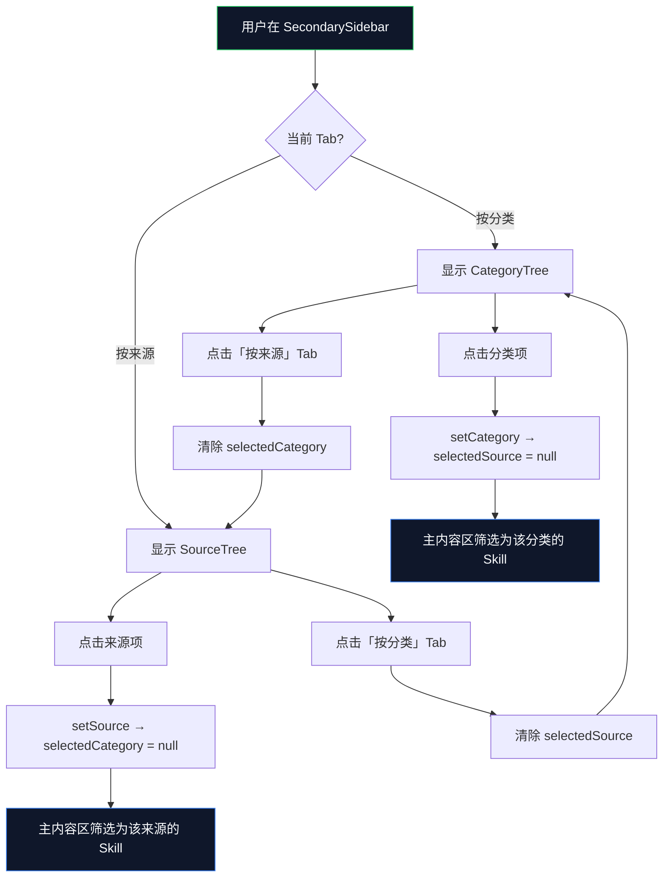
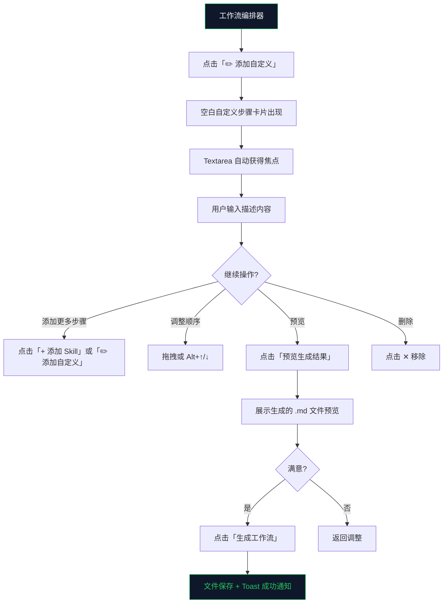
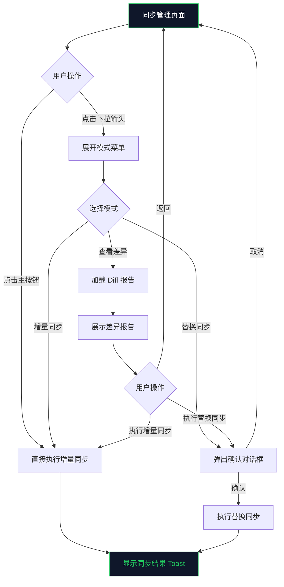

---
stepsCompleted:
  [
    "step-01-init",
    "step-02-discovery",
    "step-03-core-experience",
    "step-04-emotional-response",
    "step-05-inspiration",
    "step-06-design-system",
    "step-07-defining-experience",
    "step-08-visual-foundation",
    "step-09-design-directions",
    "step-10-user-journeys",
    "step-11-component-strategy",
    "step-12-ux-patterns",
    "step-13-responsive-accessibility",
    "step-14-complete",
  ]
inputDocuments:
  [
    "prd/prd-skill-manager-v2.md",
    "brief/product-brief-skill-manager-v2.md",
    "ux/ux-design-specification.md",
    "project-context.md",
  ]
workflowType: "ux-design"
baseDesignSystem: "ux/ux-design-specification.md"
---

# UX Design Specification — Skill Manager V2

**Author:** Alex
**Date:** 2026-04-14
**Base:** 本文档是对 `ux-design-specification.md`（V1）的增量补充，V1 中定义的设计系统、色彩体系、排版、组件策略、响应式策略和无障碍策略继续适用。

---

## Executive Summary

### 设计范围

本 UX 设计规范聚焦 Skill Manager V2 的 4 项增强需求的交互设计：

1. **二级 Sidebar 视图切换**——新增「按来源」浏览维度
2. **工作流自定义步骤**——编排器支持自然语言自定义步骤
3. **同步多模式**——增量同步、替换同步、Diff 查看
4. **默认套件全选修复**——Bug 修复，无新增 UI

### 设计原则延续

延续 V1 的核心设计原则：
- **Code Dark + Run Green** 暗色主题
- **键盘优先**的交互模式
- **最短路径到价值**的信息架构
- **即时反馈**的操作响应

### 关键设计决策

| 决策 | 选择 | 理由 |
|------|------|------|
| Tab 切换器位置 | SecondarySidebar 顶部 | 与现有分类树共享空间，不增加布局复杂度 |
| 自定义步骤视觉 | 虚线边框 + ✏️ 图标 | 与 Skill 步骤（实线边框 + ⚡ 图标）形成清晰对比 |
| 同步模式入口 | SplitButton（主按钮 + 下拉） | 80% 用户只看到一个按钮，高级用户通过下拉访问 |
| Diff 结果操作 | 结果页底部内联按钮 | 减少页面跳转，用户在查看差异后直接操作 |

---

## 需求 1：二级 Sidebar 视图切换

### 交互设计

#### Tab 切换器

**位置：** `SecondarySidebar` 顶部，在"管理分类"按钮上方

**视觉规格：**

```
┌──────────────────────────┐
│  [按分类]  [按来源]        │  ← Tab 切换器
│  ─────────────────────── │
│  📂 全部 (42)             │  ← 视图内容
│  ├─ 编程开发 (12)         │
│  ├─ 文档写作 (5)          │
│  ├─ 工作流 (3)            │
│  └─ ...                   │
│  ─────────────────────── │
│  ⚙️ 管理分类              │
└──────────────────────────┘
```

**Tab 样式：**
- 未选中：`text-secondary`（`#94A3B8`），无底边框
- 选中：`text-primary`（`#F8FAFC`），底边框 `2px solid #22C55E`（Run Green）
- Hover：`text-primary`，无底边框
- 焦点：`outline: 2px solid #22C55E`，`outline-offset: 2px`

**交互行为：**
- 点击 Tab 切换视图内容
- 切换时自动清除当前维度的筛选状态
- 切换回原 Tab 时，筛选状态不保留（重新从「全部」开始）
- 键盘：`Tab` 键在两个 Tab 间移动焦点，`Enter`/`Space` 激活

#### SourceTree 组件

**位置：** 「按来源」Tab 激活时，替换 `CategoryTree` 的位置

**视觉规格：**

```
┌──────────────────────────┐
│  [按分类]  [按来源]        │
│  ─────────────────────── │
│  🌐 全部              42  │  ← 来源列表
│  👤 我的 Skill         20  │
│  🏢 Anthropic Official 12  │
│  🌟 Awesome Copilot   10  │
└──────────────────────────┘
```

**列表项样式：**
- 图标 + 来源名称 + 右侧数量 Badge
- 未选中：`bg-transparent`，`text-secondary`
- Hover：`bg-surface-hover`（`#1E293B`）
- 选中（active）：`bg-surface-active`（`#0F172A`），左侧 `3px solid #22C55E` 指示条，`text-primary`
- Badge：`bg-surface`（`#1E293B`），`text-secondary`，圆角 `rounded-full`，`px-2 py-0.5`，`text-xs`

**来源图标映射：**
- 全部：🌐
- 我的 Skill（source 为空）：👤
- 外部仓库：根据仓库名称首字母生成，或使用 🏢（官方）/ 🌟（社区）

**空状态：**
- 如果某个来源下没有 Skill，该来源项仍然显示，Badge 为 `0`，点击后主内容区显示空状态提示

#### 筛选状态互斥

**状态管理规则：**
- `selectedCategory` 和 `selectedSource` 互斥
- 调用 `setCategory` 时自动执行 `selectedSource = null`
- 调用 `setSource` 时自动执行 `selectedCategory = null`
- 切换 Tab 时清除当前维度的筛选

**视觉反馈：**
- 切换 Tab 时，之前选中的列表项高亮消失
- 主内容区的 Skill 列表即时更新（无加载延迟）

### 用户流程



---

## 需求 2：工作流自定义步骤

### 交互设计

#### 添加自定义步骤按钮

**位置：** 工作流编排器右侧步骤列表底部，与「从 Skill 列表添加」按钮并列

**视觉规格：**

```
右侧：工作流步骤列表
┌─────────────────────────────────┐
│  Step 1: code-review        ✕   │  ← Skill 步骤（实线边框）
│  ⚡ 执行全面的代码审查            │
├─────────────────────────────────┤
│  Step 2: 自定义步骤          ✕   │  ← 自定义步骤（虚线边框）
│  ✏️ 检查暂存区的代码，并分析      │
│     本次修改的意图和目的          │
├─────────────────────────────────┤
│  Step 3: staged-fast-commit  ✕   │  ← Skill 步骤（实线边框）
│  ⚡ 生成规范化提交信息            │
├─────────────────────────────────┤
│  [+ 添加 Skill]  [✏️ 添加自定义]  │  ← 操作按钮
└─────────────────────────────────┘
```

**按钮样式：**
- 「+ 添加 Skill」：`variant="outline"`，`border-solid`，图标 `+`
- 「✏️ 添加自定义」：`variant="outline"`，`border-dashed`，图标 `✏️`

#### 自定义步骤卡片

**视觉区分：**

| 属性 | Skill 步骤 | 自定义步骤 |
|------|-----------|-----------|
| 边框 | `border-solid 1px #334155` | `border-dashed 2px #475569` |
| 图标 | ⚡（闪电） | ✏️（铅笔） |
| 标题 | Skill 名称（如 `code-review`） | "自定义步骤" |
| 内容 | 步骤描述（只读） | Textarea（可编辑） |
| 背景 | `bg-card`（`#1E293B`） | `bg-card` + 微弱的斜线纹理（`bg-[repeating-linear-gradient]`） |

**Textarea 规格：**
- 初始高度：1 行（约 40px）
- 自动扩展：随内容增长自动扩展，最大 6 行
- 占位符文字：`"输入自定义步骤描述，如：检查暂存区的代码，并分析意图"`
- 字体：`font-mono`，`text-sm`
- 颜色：`text-primary`（`#F8FAFC`）
- 边框：无（融入卡片背景）
- 焦点：卡片整体获得 `outline: 2px solid #22C55E`

**交互行为：**
- 点击「✏️ 添加自定义」→ 在步骤列表末尾添加空白自定义步骤卡片，Textarea 自动获得焦点
- 拖拽排序：与 Skill 步骤使用相同的拖拽手柄（≡），支持 `Alt+↑/↓` 键盘排序
- 删除：点击 ✕ 按钮移除，无需确认（因为内容可以重新输入）
- 编辑：直接在 Textarea 中修改内容

#### 生成预览中的自定义步骤

**预览格式：**

```markdown
## Step 1: 代码审查

**使用 Skill:** `code-review`

执行全面的代码审查，检查代码风格、潜在 bug、性能问题等。

## Step 2: 分析暂存区意图

检查暂存区的代码，并分析本次修改的意图和目的。

## Step 3: 快速提交

**使用 Skill:** `staged-fast-commit`

生成规范化提交信息并执行提交。
```

自定义步骤不生成 `**使用 Skill:**` 行，直接输出描述内容。

### 用户流程



---

## 需求 3：同步多模式

### 交互设计

#### SplitButton 同步按钮

**位置：** 同步管理页面，原"同步"按钮位置

**视觉规格：**

```
┌──────────────┬───┐
│  🔄 增量同步  │ ▾ │  ← SplitButton
└──────────────┴───┘
```

**主按钮：**
- 文字：「🔄 增量同步」
- 样式：`bg-run-green`（`#22C55E`），`text-black`，`font-semibold`
- Hover：`bg-run-green/90`
- 点击：直接执行增量同步

**下拉箭头：**
- 样式：与主按钮同色，左侧 `1px solid` 分割线（`rgba(0,0,0,0.2)`）
- 图标：`▾`（向下三角）
- 点击：展开下拉菜单

**下拉菜单：**

```
┌──────────────────────────┐
│  🔄 增量同步              │  ← 默认选项
│  🔁 替换同步              │
│  ─────────────────────── │
│  📋 查看差异              │  ← 分割线分隔（非破坏性操作）
└──────────────────────────┘
```

- 菜单背景：`bg-surface`（`#1E293B`），`border: 1px solid #334155`
- 菜单项 Hover：`bg-surface-hover`（`#334155`）
- 分割线：将「查看差异」与同步操作分开（因为 Diff 不执行文件操作）
- 键盘：`Arrow Up/Down` 选择，`Enter` 确认，`Esc` 关闭

#### 替换同步确认对话框

**触发：** 选择「🔁 替换同步」后

**视觉规格：**

```
┌──────────────────────────────────────┐
│  ⚠️ 替换同步确认                       │
│                                       │
│  此操作将删除目标目录中以下 Skill       │
│  文件夹，然后重新同步：                  │
│                                       │
│  • coding/code-review/                │
│  • coding/staged-fast-commit/         │
│  • workflows/pre-commit-check/        │
│  ... 共 35 个文件夹                    │
│                                       │
│  此操作不可撤销。                       │
│                                       │
│  [取消]              [确认替换同步]     │
└──────────────────────────────────────┘
```

- 使用 `AlertDialog`（V1 已有的危险操作确认模式）
- 「确认替换同步」按钮：`bg-destructive`（红色），`text-white`
- 文件夹列表最多显示 10 个，超出显示"... 共 N 个文件夹"

#### Diff 差异报告

**触发：** 选择「📋 查看差异」后

**加载状态：**
- 显示 Skeleton 加载动画 + "正在对比文件差异..."
- 预计耗时 < 2s

**结果展示：**

```
┌──────────────────────────────────────────────┐
│  📋 差异报告                                   │
│  ─────────────────────────────────────────── │
│  摘要：新增 2 · 修改 3 · 删除 0 · 相同 37     │
│  ─────────────────────────────────────────── │
│                                               │
│  🟢 新增                                      │
│  ├─ workflows/pre-commit-check/SKILL.md       │
│  └─ workflows/code-quality/SKILL.md           │
│                                               │
│  🟡 修改                                      │
│  ├─ coding/code-review/SKILL.md               │
│  ├─ coding/staged-fast-commit/SKILL.md        │
│  └─ devops/deploy-check/SKILL.md              │
│                                               │
│  ⚪ 相同 (37 个)                    [展开 ▾]   │
│                                               │
│  ─────────────────────────────────────────── │
│  [🔄 执行增量同步]        [🔁 执行替换同步]     │
└──────────────────────────────────────────────┘
```

**列表项样式：**
- 🟢 新增：`text-green-400`（`#4ADE80`）
- 🟡 修改：`text-yellow-400`（`#FACC15`）
- 🔴 删除：`text-red-400`（`#F87171`）
- ⚪ 相同：`text-secondary`（`#94A3B8`），默认折叠，点击展开

**摘要栏：**
- 背景：`bg-surface`（`#1E293B`）
- 使用 Badge 样式展示各状态数量
- 数量为 0 的状态不显示

**底部操作按钮：**
- 「🔄 执行增量同步」：`variant="default"`，`bg-run-green`
- 「🔁 执行替换同步」：`variant="outline"`，`border-destructive`
- 按钮间距：`gap-3`

**无障碍：**
- 状态图标提供 `aria-label`（如 `aria-label="新增"`）
- 列表使用 `role="list"` + `role="listitem"`
- 摘要栏使用 `aria-live="polite"` 在加载完成后播报

#### 增量同步结果

**同步完成后的结果展示：**

```
┌──────────────────────────────────────┐
│  ✅ 增量同步完成                       │
│                                       │
│  新增: 2 个                            │
│  更新: 3 个                            │
│  跳过: 37 个（未变化）                  │
│                                       │
│  耗时: 0.8s                            │
└──────────────────────────────────────┘
```

- 使用 Toast 通知（V1 已有模式）
- Toast 持续时间：5 秒（比普通 Toast 的 3 秒更长，因为信息量更大）
- 新增/更新使用绿色文字，跳过使用灰色文字

### 用户流程



---

## 需求 4：默认套件全选修复

### 交互设计

**无新增 UI 元素。** 这是纯逻辑修复：

- 选择默认套件后，`selectedSkillIds` 应包含 9 个出厂分类下的所有 Skill ID
- 修复前：部分 Skill（特别是外部 Skill）未被选中
- 修复后：所有 Skill 的复选框全部勾选

**视觉验证点：**
- 套件选择后，Skill 列表中所有复选框应为 ✅ 状态
- 底部的"已选 N 个 Skill"计数应等于总 Skill 数

---

## 新增组件规格

### SourceTree

**类型：** 自定义组件
**位置：** `src/components/skills/SourceTree.tsx`
**用途：** 在「按来源」视图中展示来源列表

**Props：**

```typescript
interface SourceTreeProps {
  sources: Array<{
    name: string;       // 来源名称（如 "Anthropic Official"）
    key: string;        // 来源标识（如 "anthropic-official"，空字符串表示"我的 Skill"）
    count: number;      // 该来源下的 Skill 数量
    icon: string;       // 图标（emoji）
  }>;
  selectedSource: string | null;
  onSelectSource: (source: string | null) => void;
}
```

**状态：**
- default、hover、active（当前选中来源）
- 与 `CategoryTree` 共享相同的列表项高度和间距

### ViewTab

**类型：** 自定义组件
**位置：** `src/components/skills/ViewTab.tsx`
**用途：** SecondarySidebar 顶部的视图切换 Tab

**Props：**

```typescript
interface ViewTabProps {
  activeView: 'category' | 'source';
  onViewChange: (view: 'category' | 'source') => void;
}
```

### CustomStepCard

**类型：** 自定义组件
**位置：** `src/components/workflow/CustomStepCard.tsx`
**用途：** 工作流编排器中的自定义步骤卡片

**Props：**

```typescript
interface CustomStepCardProps {
  step: WorkflowStep;  // type === 'custom'
  index: number;
  onDescriptionChange: (description: string) => void;
  onRemove: () => void;
  onMoveUp: () => void;
  onMoveDown: () => void;
}
```

### SyncSplitButton

**类型：** 自定义组件
**位置：** `src/components/sync/SyncSplitButton.tsx`
**用途：** 同步模式选择的 SplitButton

**Props：**

```typescript
interface SyncSplitButtonProps {
  onSync: (mode: 'incremental' | 'replace') => void;
  onDiff: () => void;
  disabled?: boolean;
  loading?: boolean;
}
```

### DiffReport

**类型：** 自定义组件
**位置：** `src/components/sync/DiffReport.tsx`
**用途：** Diff 差异报告展示

**Props：**

```typescript
interface DiffReportProps {
  report: {
    added: Array<{ name: string; path: string }>;
    modified: Array<{ name: string; path: string }>;
    deleted: Array<{ name: string; path: string }>;
    unchanged: Array<{ name: string; path: string }>;
  };
  onSyncIncremental: () => void;
  onSyncReplace: () => void;
}
```

---

## 响应式适配补充

### Tab 切换器

| 断点 | 行为 |
|------|------|
| Wide（≥ 1440px） | Tab 文字完整显示 |
| Standard（1024-1439px） | Tab 文字完整显示 |
| Compact（< 1024px） | Tab 在抽屉式侧边栏中显示，行为不变 |

### SplitButton

| 断点 | 行为 |
|------|------|
| Wide / Standard | 主按钮文字 + 下拉箭头 |
| Compact | 主按钮文字缩短为「同步」+ 下拉箭头 |

### Diff 报告

| 断点 | 行为 |
|------|------|
| Wide / Standard | 完整列表展示 |
| Compact | 列表项路径截断，底部按钮堆叠为纵向排列 |

---

## 无障碍补充

### Tab 切换器

- `role="tablist"` 容器
- 每个 Tab：`role="tab"`，`aria-selected="true/false"`，`aria-controls="panel-id"`
- Tab 面板：`role="tabpanel"`，`aria-labelledby="tab-id"`
- 键盘：`Arrow Left/Right` 在 Tab 间切换焦点，`Enter/Space` 激活

### SourceTree

- 列表：`role="listbox"`，`aria-label="按来源筛选 Skill"`
- 列表项：`role="option"`，`aria-selected="true/false"`
- Badge：`aria-label="12 个 Skill"`（数量信息包含在 ARIA 标签中）

### SplitButton

- 主按钮：`aria-label="增量同步"`
- 下拉按钮：`aria-haspopup="menu"`，`aria-expanded="true/false"`，`aria-label="更多同步选项"`
- 菜单：`role="menu"`
- 菜单项：`role="menuitem"`

### Diff 报告

- 摘要：`aria-live="polite"`，加载完成后播报
- 状态图标：`aria-label="新增"` / `"修改"` / `"删除"` / `"相同"`
- 列表：`role="list"`
- 操作按钮：标准 `button` 语义

### 自定义步骤

- Textarea：`aria-label="自定义步骤描述"`
- 拖拽手柄：`aria-label="拖拽排序"`，`aria-grabbed`
- 删除按钮：`aria-label="移除此步骤"`
