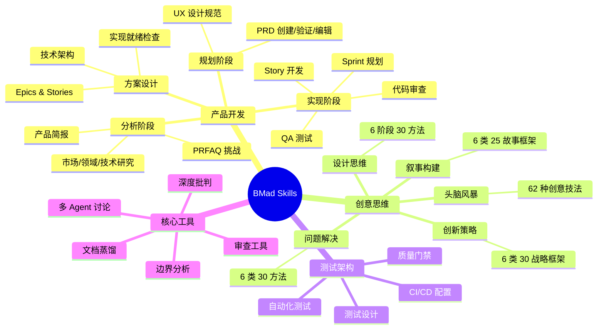

# BMad Skills 安装清单

> 生成时间：2026-04-10
> BMad 版本：6.3.0
> IDE：CodeBuddy

---

## 安装概览

当前项目共安装了 **5 个 BMad 模块**，包含 **66 个 Skills**（含 14 个 Agent Skills + 52 个 Workflow/Utility Skills）。

| 模块名称 | 版本 | 来源 | 说明 |
|---------|------|------|------|
| **Core** | 6.3.0 | 内置 | 核心工具集，提供通用审查、编辑、压缩等基础能力 |
| **BMad Method (bmm)** | 6.3.0 | 内置 | 完整的产品开发方法论，覆盖分析→规划→方案→实现全流程 |
| **BMad Builder (bmb)** | 1.5.0 | 外部 (`bmad-builder`) | Agent/Workflow/Module 构建器 |
| **Creative Intelligence Suite (cis)** | 0.1.9 | 外部 (`bmad-creative-intelligence-suite`) | 创意智能套件，头脑风暴、设计思维、创新策略等 |
| **Test Architecture Enterprise (tea)** | 1.7.2 | 外部 (`bmad-method-test-architecture-enterprise`) | 企业级测试架构，测试设计、自动化、CI/CD 等 |

---

## 一、Core 模块（核心工具集）

核心模块提供跨阶段通用的基础工具，可在任何时候使用。

### 1.1 Skills 列表

| Skill 名称 | 简码 | 作用描述 | 触发方式 |
|-----------|------|---------|---------|
| `bmad-help` | BH | BMad 帮助导航，分析当前状态并推荐下一步操作 | 说 "bmad help" 或 "what to do next" |
| `bmad-party-mode` | PM | 多 Agent 群组讨论，让多个 Agent 从不同视角协作对话 | 说 "party mode" 或 "group discussion" |
| `bmad-brainstorming` | BSP | 交互式头脑风暴，使用多种创意技法引导构思 | 说 "help me brainstorm" |
| `bmad-advanced-elicitation` | — | 深度批判与优化，推动 LLM 重新审视和改进输出 | 提及 socratic、first principles、pre-mortem、red team 等方法 |
| `bmad-distillator` | DG | 无损压缩文档，生成 token 高效的蒸馏版本供下游 LLM 消费 | 说 "distill documents" |
| `bmad-editorial-review-prose` | EP | 文案润色审查，检查文本的沟通问题并给出修改建议 | 说 "review for prose" |
| `bmad-editorial-review-structure` | ES | 结构性编辑审查，提出裁剪、重组和简化建议 | 说 "structural review" |
| `bmad-review-adversarial-general` | AR | 对抗性审查，以批判视角审查内容并生成发现报告 | 说 "critical review" |
| `bmad-review-edge-case-hunter` | ECH | 边界用例猎手，遍历所有分支路径和边界条件，报告未处理的边界情况 | 需要穷举边界分析时使用 |
| `bmad-index-docs` | ID | 文档索引生成，创建/更新 index.md 引用文件夹内所有文档 | 说 "create index" |
| `bmad-shard-doc` | SD | 文档分片，将大型 Markdown 按二级标题拆分为多个小文件 | 说 "shard document" |

### 1.2 重点 Skill 能力详解

#### 🔥 bmad-party-mode（多 Agent 群组讨论）

**核心价值**：让多个 Agent 作为**真实子代理**独立思考，而非一个 LLM 扮演多个角色。真正实现观点的多样性和独立性。

**工作原理**：
1. 读取 Agent 清单 (`agent-manifest.csv`)
2. 根据用户问题选择 2-4 个相关 Agent
3. **并行**启动多个子代理，每个独立思考
4. 展示各 Agent 完整回复（不做总结或合成）

**参数选项**：
- `--model <model>` — 强制所有子代理使用特定模型（如 `haiku`、`opus`）
- `--solo` — 单 LLM 模式（无子代理，由当前 LLM 扮演所有角色）

**使用场景**：
- 需要多角度审视复杂决策
- 让不同专业背景的 Agent "辩论"
- 收集多元视角避免盲点

---

#### 🔥 bmad-advanced-elicitation（深度批判与优化）

**50 种深度思维方法**，分为以下类别：

| 类别 | 方法数量 | 核心方法示例 |
|------|---------|------------|
| **核心方法** | 6 | First Principles（第一性原理）、Socratic Questioning（苏格拉底式提问）、5 Whys Deep Dive、Critique and Refine |
| **协作方法** | 10 | Stakeholder Round Table（利益相关者圆桌）、Debate Club Showdown（辩论赛）、Cross-Functional War Room、Time Traveler Council |
| **高级方法** | 6 | Tree of Thoughts（思维树）、Graph of Thoughts（思维图谱）、Self-Consistency Validation、Meta-Prompting Analysis |
| **竞争方法** | 3 | Red Team vs Blue Team、Shark Tank Pitch、Code Review Gauntlet |
| **技术方法** | 4 | Architecture Decision Records、Rubber Duck Debugging Evolved、Security Audit Personas、Performance Profiler Panel |
| **创意方法** | 6 | SCAMPER Method、Reverse Engineering、What If Scenarios、Random Input Stimulus、Genre Mashup |
| **风险方法** | 5 | Pre-mortem Analysis（事前验尸）、Failure Mode Analysis、Chaos Monkey Scenarios、Identify Potential Risks |
| **研究方法** | 3 | Literature Review Personas、Thesis Defense Simulation、Comparative Analysis Matrix |
| **学习/哲学** | 4 | Feynman Technique、Active Recall Testing、Occam's Razor、Trolley Problem Variations |

---

#### 🔥 bmad-brainstorming（交互式头脑风暴）

**62 种创意技法**，分为以下类别：

| 类别 | 方法数量 | 核心方法示例 |
|------|---------|------------|
| **协作类** | 5 | Yes And Building（是的，而且...）、Brain Writing Round Robin、Role Playing、Ideation Relay Race |
| **创意类** | 10 | What If Scenarios、Analogical Thinking（类比思维）、Reversal Inversion（逆向反转）、First Principles Thinking、Forced Relationships、Time Shifting、Metaphor Mapping、Cross-Pollination |
| **深度类** | 8 | Five Whys、Morphological Analysis（形态分析）、Provocation Technique、Assumption Reversal、Question Storming、Constraint Mapping、Emergent Thinking |
| **内省类** | 6 | Inner Child Conference（内在小孩会议）、Shadow Work Mining、Values Archaeology、Future Self Interview、Body Wisdom Dialogue |
| **结构化** | 7 | SCAMPER Method、Six Thinking Hats（六顶思考帽）、Mind Mapping、Resource Constraints、Decision Tree Mapping、Solution Matrix |
| **戏剧类** | 6 | Time Travel Talk Show、Alien Anthropologist（外星人类学家）、Dream Fusion Laboratory、Emotion Orchestra、Parallel Universe Cafe |
| **狂野类** | 9 | Chaos Engineering、Guerrilla Gardening Ideas、Pirate Code Brainstorm、Zombie Apocalypse Planning、Drunk History Retelling、Anti-Solution、Quantum Superposition |
| **仿生类** | 3 | Nature's Solutions、Ecosystem Thinking、Evolutionary Pressure |
| **文化类** | 4 | Indigenous Wisdom、Fusion Cuisine、Ritual Innovation、Mythic Frameworks |

---

#### 🔥 bmad-distillator（文档蒸馏引擎）

**核心定位**：这是一个**压缩任务**，而非摘要任务。摘要是有损的，蒸馏是无损压缩——专门优化给 LLM 消费。

**工作流程**：
1. **分析阶段** — 分析源文档，确定路由策略和分组
2. **压缩阶段** — 启动压缩代理生成蒸馏版本
   - 单文档模式：≤3 个文件，≤15K tokens
   - 扇出模式：分组压缩后合并
3. **验证阶段** — 完整性检查、格式检查、输出保存
4. **往返验证**（可选）— 从蒸馏版本重建源文档，验证无损

**输出格式**：
```yaml
---
type: bmad-distillate
sources: ["path/to/source1.md", "path/to/source2.md"]
downstream_consumer: "PRD creation"
created: "2026-04-10"
token_estimate: 3500
parts: 1
---
```

**应用场景**：
- 为下游 LLM 工作流准备上下文
- 压缩大量文档供 AI 消费
- 在 token 预算内传递完整信息

---

## 二、BMad Method 模块（产品开发方法论）

完整的产品开发流程，分为 4 个阶段：分析 → 规划 → 方案设计 → 实现。

### 2.1 Agent Skills（角色代理）

| Agent 名称 | 代号 | 角色定位 | 触发方式 |
|-----------|------|---------|---------|
| `bmad-agent-analyst` | Mary | 📊 战略业务分析师 + 需求专家，擅长市场研究、竞品分析、需求提炼 | 说 "talk to Mary" 或 "business analyst" |
| `bmad-agent-pm` | John | 📋 产品经理，专注 PRD 创建和需求发现 | 说 "talk to John" 或 "product manager" |
| `bmad-agent-ux-designer` | Sally | 🎨 UX 设计师 + UI 专家，用户研究和交互设计 | 说 "talk to Sally" 或 "UX designer" |
| `bmad-agent-architect` | Winston | 🏗️ 系统架构师 + 技术设计负责人，分布式系统和云基础设施 | 说 "talk to Winston" 或 "architect" |
| `bmad-agent-dev` | Amelia | 💻 高级软件工程师，执行 Story 实现和代码开发 | 说 "talk to Amelia" 或 "developer agent" |
| `bmad-agent-tech-writer` | Paige | 📚 技术文档专家 + 知识管理者 | 说 "talk to Paige" 或 "tech writer" |

#### Paige（技术文档专家）能力详解

| 代码 | 能力 | 类型 |
|------|------|------|
| DP | 生成全面项目文档（棕地分析、架构扫描） | Skill: `bmad-document-project` |
| WD | 按最佳实践编写文档（引导式对话） | Prompt: `write-document.md` |
| MG | 创建 Mermaid 图表 | Prompt: `mermaid-gen.md` |
| VD | 验证文档质量和标准合规 | Prompt: `validate-doc.md` |
| EC | 创建清晰的技术解释（含示例和图表） | Prompt: `explain-concept.md` |

---

### 2.2 阶段一：分析（Analysis）

| Skill 名称 | 简码 | 作用描述 |
|-----------|------|---------|
| `bmad-product-brief` | CB | 产品简报创建，通过引导式发现梳理产品概念 |
| `bmad-prfaq` | WB | PRFAQ 挑战，Working Backwards 方法压力测试产品概念 |
| `bmad-domain-research` | DR | 领域研究，行业深度调研和专业术语梳理 |
| `bmad-market-research` | MR | 市场研究，竞争格局、客户需求和趋势分析 |
| `bmad-technical-research` | TR | 技术研究，技术可行性和架构方案评估 |
| `bmad-document-project` | DP | 项目文档化，分析现有项目生成 AI 可用的文档 |

---

### 2.3 阶段二：规划（Planning）

| Skill 名称 | 简码 | 作用描述 |
|-----------|------|---------|
| `bmad-create-prd` | CP | 创建 PRD（产品需求文档），专家引导式产出 |
| `bmad-validate-prd` | VP | 验证 PRD，对照标准检查 PRD 质量 |
| `bmad-edit-prd` | EP | 编辑 PRD，修改已有的 PRD 文档 |
| `bmad-create-ux-design` | CU | 创建 UX 设计，规划 UX 模式和设计规范 |

---

### 2.4 阶段三：方案设计（Solutioning）

| Skill 名称 | 简码 | 作用描述 |
|-----------|------|---------|
| `bmad-create-architecture` | CA | 创建技术架构，引导式记录技术决策 |
| `bmad-create-epics-and-stories` | CE | 创建 Epics 和 Stories，将需求拆解为史诗和用户故事 |
| `bmad-check-implementation-readiness` | IR | 实现就绪检查，验证 PRD/UX/架构/Epics 是否对齐完整 |
| `bmad-generate-project-context` | GPC | 生成项目上下文，扫描代码库生成 LLM 优化的 project-context.md |

---

### 2.5 阶段四：实现（Implementation）

| Skill 名称 | 简码 | 作用描述 |
|-----------|------|---------|
| `bmad-sprint-planning` | SP | Sprint 规划，生成实现计划供 Agent 按序执行 |
| `bmad-sprint-status` | SS | Sprint 状态，汇总进度并路由到下一个工作流 |
| `bmad-create-story` | CS/VS | 创建 Story / 验证 Story，准备和校验故事文件 |
| `bmad-dev-story` | DS | 开发 Story，执行故事实现任务和测试 |
| `bmad-code-review` | CR | 代码审查，使用多层并行审查（盲点猎手、边界猎手、验收审计） |
| `bmad-checkpoint-preview` | CK | 检查点预览，LLM 辅助的人工审查，引导走查变更 |
| `bmad-qa-generate-e2e-tests` | QA | QA 自动化测试，为已实现功能生成端到端测试 |
| `bmad-quick-dev` | QQ | 快速开发，统一的意图输入→代码输出工作流 |
| `bmad-correct-course` | CC | 航向修正，管理 Sprint 执行中的重大变更 |
| `bmad-retrospective` | ER | 回顾总结，Epic 完成后的经验教训提取 |

---

## 三、BMad Builder 模块（构建器）

用于创建、编辑和分析 BMad 的 Agent、Workflow 和 Module。

| Skill 名称 | 简码 | 作用描述 |
|-----------|------|---------|
| `bmad-bmb-setup` | SB | 安装/更新 BMad Builder 模块配置 |
| `bmad-agent-builder` (Build) | BA | 通过对话式发现创建、编辑或重建 Agent Skill |
| `bmad-agent-builder` (Analyze) | AA | 对已有 Agent 进行质量分析（结构、内聚性、提示词工艺） |
| `bmad-workflow-builder` (Build) | BW | 创建、编辑或重建 Workflow/Utility Skill |
| `bmad-workflow-builder` (Analyze) | AW | 对已有 Workflow/Skill 进行质量分析 |
| `bmad-workflow-builder` (Convert) | CW | 将任意 Skill 转换为 BMad 兼容的结果导向格式 |
| `bmad-module-builder` (Ideate) | IM | 头脑风暴和规划 BMad 模块 |
| `bmad-module-builder` (Create) | CM | 将已构建的 Skills 脚手架为可安装的 BMad 模块 |
| `bmad-module-builder` (Validate) | VM | 验证模块结构的完整性和准确性 |

---

## 四、Creative Intelligence Suite 模块（创意智能套件）

提供创意思维和创新方法论工具。

### 4.1 Agent Skills（创意角色）

| Agent 名称 | 代号 | 角色定位 | 触发方式 |
|-----------|------|---------|---------|
| `bmad-cis-agent-brainstorming-coach` | Carson | 🧠 精英头脑风暴专家，创意技法引导 | 说 "talk to Carson" |
| `bmad-cis-agent-creative-problem-solver` | Dr. Quinn | 🔬 系统性问题解决大师，TRIZ/约束理论/系统思维 | 说 "talk to Dr. Quinn" |
| `bmad-cis-agent-design-thinking-coach` | Maya | 🎨 设计思维大师，以人为本的设计流程 | 说 "talk to Maya" |
| `bmad-cis-agent-innovation-strategist` | Victor | ⚡ 颠覆式创新策略师，商业模式创新 | 说 "talk to Victor" |
| `bmad-cis-agent-presentation-master` | Caravaggio | 🎨 视觉传达与演示专家，幻灯片/Pitch Deck/视觉叙事 | 说 "talk to Caravaggio" |
| `bmad-cis-agent-storyteller` | Sophia | 📖 叙事大师，使用经典框架构建引人入胜的故事 | 说 "talk to Sophia" |

### 4.2 Workflow Skills（创意工作流）

#### 🔥 bmad-cis-design-thinking（设计思维引导）

**6 个阶段，30 种方法**：

| 阶段 | 方法 | 描述 |
|------|------|------|
| **共情** | User Interviews、Empathy Mapping、Shadowing、Journey Mapping、Diary Studies | 深度理解用户需求、痛点、情感 |
| **定义** | Problem Framing、How Might We、POV Statement、Affinity Clustering、Jobs to be Done | 将观察转化为清晰的问题陈述 |
| **构思** | Brainstorming、Crazy 8s、SCAMPER Design、Provotype Sketching、Analogous Inspiration | 大量生成多样化解决方案 |
| **原型** | Paper Prototyping、Role Playing、Wizard of Oz、Storyboarding、Physical Mockups | 快速制作可测试的原型 |
| **测试** | Usability Testing、Feedback Capture Grid、A/B Testing、Assumption Testing、Iterate | 验证假设并迭代改进 |
| **实施** | Pilot Programs、Service Blueprinting、Design System Creation、Stakeholder Alignment | 将解决方案推向市场 |

---

#### 🔥 bmad-cis-innovation-strategy（创新策略）

**6 大类，30 种战略框架**：

| 类别 | 框架 | 描述 |
|------|------|------|
| **颠覆策略** | Disruptive Innovation Theory、Jobs to be Done、Blue Ocean Strategy、Crossing the Chasm、Platform Revolution | 识别颠覆机会和市场切入点 |
| **商业模式** | Business Model Canvas、Value Proposition Canvas、Business Model Patterns、Revenue Model Innovation、Cost Structure Innovation | 设计和创新商业模式 |
| **市场分析** | TAM SAM SOM Analysis、Five Forces Analysis、PESTLE Analysis、Market Timing Assessment、Competitive Positioning Map | 评估市场机会和竞争格局 |
| **战略规划** | Three Horizons Framework、Lean Startup Methodology、Innovation Ambition Matrix、Strategic Intent Development、Scenario Planning | 平衡创新组合和长期规划 |
| **价值链** | Value Chain Analysis、Unbundling Analysis、Platform Ecosystem Design、Make vs Buy Analysis、Partnership Strategy | 优化价值创造和捕获 |
| **技术策略** | Technology Adoption Lifecycle、S-Curve Analysis、Technology Roadmapping、Open Innovation Strategy、Digital Transformation Framework | 技术创新和市场时机 |

---

#### 🔥 bmad-cis-problem-solving（系统性问题解决）

**6 大类，30 种方法**：

| 类别 | 方法 | 描述 |
|------|------|------|
| **诊断** | Five Whys Root Cause、Fishbone Diagram、Problem Statement Refinement、Is/Is Not Analysis、Systems Thinking | 深入分析问题根因 |
| **分析** | Force Field Analysis、Pareto Analysis、Gap Analysis、Constraint Identification、Failure Mode Analysis | 理解问题结构和约束 |
| **综合** | TRIZ Contradiction Matrix、Lateral Thinking Techniques、Morphological Analysis、Biomimicry Problem Solving、Synectics Method | 生成创新解决方案 |
| **评估** | Decision Matrix、Cost Benefit Analysis、Risk Assessment Matrix、Pilot Testing Protocol、Feasibility Study | 评估和选择最佳方案 |
| **实施** | PDCA Cycle、Gantt Chart Planning、Stakeholder Mapping、Change Management Protocol、Monitoring Dashboard | 执行和监控解决方案 |
| **创意** | Assumption Busting、Random Word Association、Reverse Brainstorming、Six Thinking Hats、SCAMPER for Problems | 打破常规思维 |

---

#### 🔥 bmad-cis-storytelling（叙事构建）

**6 大类，25 种故事框架**：

| 类别 | 框架 | 描述 |
|------|------|------|
| **转型类** | Hero's Journey（英雄之旅）、Pixar Story Spine、Customer Journey、Challenge Overcome、Character Arc | 展示转变和成长 |
| **战略类** | Brand Story、Vision Narrative、Origin Story、Positioning Story、Culture Story | 传达愿景和定位 |
| **说服类** | Pitch Narrative、Sales Story、Change Story、Fundraising Story、Advocacy Story | 激发行动和支持 |
| **分析类** | Data Storytelling、Case Study、Research Narrative、Insight Narrative、Process Story | 将数据转化为洞察 |
| **情感类** | Hook Driven、Conflict Resolution、Empathy Story、Human Interest、Vulnerable Story | 建立情感连接 |

---

## 五、Test Architecture Enterprise 模块（测试架构）

企业级测试架构工具集，覆盖测试设计、自动化、CI/CD 和质量门禁。

### 5.1 Agent Skill

| Agent 名称 | 代号 | 角色定位 | 触发方式 |
|-----------|------|---------|---------|
| `bmad-tea` | Murat | 🧪 测试架构大师 + 质量顾问，风险驱动测试、ATDD、API/UI 自动化、CI/CD 治理 | 说 "talk to Murat" 或 "test architect" |

### 5.2 Workflow Skills（测试工作流）

| Skill 名称 | 简码 | 作用描述 | 阶段 |
|-----------|------|---------|------|
| `bmad-teach-me-testing` | TMT | 测试教学，通过 7 节课程渐进式学习测试基础（TEA Academy） | 学习 |
| `bmad-testarch-test-design` | TD | 测试设计，基于风险的测试规划 | 方案设计 |
| `bmad-testarch-framework` | TF | 测试框架初始化，使用 Playwright 或 Cypress 搭建生产级框架 | 方案设计 |
| `bmad-testarch-ci` | CI | CI/CD 配置，搭建质量流水线和测试执行 | 方案设计 |
| `bmad-testarch-atdd` | AT | ATDD 验收测试驱动开发，生成失败测试（TDD 红灯阶段） | 实现 |
| `bmad-testarch-automate` | TA | 测试自动化，扩展代码库的测试覆盖率 | 实现 |
| `bmad-testarch-test-review` | RV | 测试审查，质量审计（0-100 评分） | 实现 |
| `bmad-testarch-nfr` | NR | 非功能需求评估，性能/安全/可靠性评估 | 实现 |
| `bmad-testarch-trace` | TR | 可追溯性矩阵，覆盖率追踪和质量门禁决策 | 实现 |

---

## 六、非 BMad 体系的独立 Skills

项目中还安装了以下非 BMad 体系的独立 Skills：

### 6.1 ui-ux-pro-max

**UI/UX 设计智能工具**，带可搜索的设计数据库。

**数据库规模**：
- 67 种设计风格
- 96 个配色方案
- 57 组字体配对
- 99 条 UX 指南
- 25 种图表类型
- 13 个技术栈支持

**支持的检索域**：

| 域 | 用途 | 示例关键词 |
|----|------|----------|
| `product` | 产品类型推荐 | SaaS, e-commerce, portfolio, healthcare |
| `style` | UI 风格、颜色、效果 | glassmorphism, minimalism, dark mode |
| `typography` | 字体配对、Google Fonts | elegant, playful, professional |
| `color` | 配色方案 | saas, ecommerce, fintech |
| `landing` | 页面结构、CTA 策略 | hero, testimonial, pricing |
| `chart` | 图表类型推荐 | trend, comparison, funnel |
| `ux` | 最佳实践、反模式 | animation, accessibility, z-index |
| `react` | React/Next.js 性能 | waterfall, bundle, suspense, memo |
| `web` | Web 界面指南 | aria, focus, semantic, virtualize |

**支持的技术栈**：
`html-tailwind`（默认）、`react`、`nextjs`、`vue`、`svelte`、`swiftui`、`react-native`、`flutter`、`shadcn`、`jetpack-compose`

**使用示例**：
```bash
# 生成设计系统
python3 skills/ui-ux-pro-max/scripts/search.py "beauty spa wellness service" --design-system -p "Project Name"

# 搜索 UX 最佳实践
python3 skills/ui-ux-pro-max/scripts/search.py "animation accessibility" --domain ux

# 获取技术栈指南
python3 skills/ui-ux-pro-max/scripts/search.py "layout responsive form" --stack html-tailwind
```

---

### 6.2 其他全局 Skills（系统级安装）

以下 Skills 为系统级全局安装，不在项目目录中：

| Skill 名称 | 作用描述 | 触发关键词 |
|-----------|---------|----------|
| `code-comment-writer` | 代码注释编写，根据阅读场景补充精简、有效的注释 | 「帮我写注释」「加注释」「代码可读性」 |
| `context-learning` | 上下文分析，梳理文件核心逻辑与引用链路 | 「帮我理解这段代码」「分析这个模块」 |
| `cross-branch-fix-porter` | 跨分支修复移植，将修复应用到结构差异较大的分支 | 「移植这个修复」「跨分支应用修复」 |
| `enhanced-skill-creator` | Skill 创建器，生成符合规范的标准 Skill 技能包 | 「创建 Skill」「新建技能包」 |
| `feature-port-doc-generator` | 需求移植文档生成，整理需求改造意图和移植流程 | 「生成移植文档」「整理移植指南」 |
| `frontend-code-review` | 前端代码审查，自动检测并修复 ESLint 错误 | 「帮我做代码审查」「代码体检」 |
| `frontend-staged-bundle-review` | 暂存区包体积审查，分析代码体积并给出优化建议 | 「检查暂存区体积」「bundle 优化」 |
| `react-component-extraction` | React 组件抽取，分析依赖并安全抽取组件/Hook | 「抽取组件」「提取为 Hook」 |
| `react-component-refactor` | React 组件重构，按最佳实践重构大型组件 | 「重构组件」「拆分重构」 |
| `staged-fast-commit` | 快速提交，跳过审查直接规范化提交 | 「快速提交」「fast commit」 |
| `staged-test-coverage` | 暂存区测试用例设计，分析变更并设计测试用例 | 「测试用例覆盖」「生成测试报告」 |
| `tech-stack-detection` | 技术栈检测，识别项目依赖、框架和配置 | 「检测技术栈」「分析项目配置」 |
| `bug-fix-workflow` | Bug 修复工作流 | — |
| `code-review-workflow` | 代码审查工作流 | — |
| `staged-code-review` | 暂存区代码审查 | — |
| `staged-review-workflow` | 暂存区审查工作流 | — |
| `explore` | 探索模式 | — |
| `react-performance` | React 性能优化 | — |

---

## 七、技能能力矩阵

### 按功能领域分类



### 快速查找表

| 我想... | 推荐使用的 Skill |
|--------|-----------------|
| 创建产品需求文档 | `bmad-create-prd` |
| 设计技术架构 | `bmad-create-architecture` |
| 头脑风暴创意 | `bmad-brainstorming` 或 `talk to Carson` |
| 设计思维流程 | `bmad-cis-design-thinking` |
| 制定创新策略 | `bmad-cis-innovation-strategy` |
| 解决复杂问题 | `bmad-cis-problem-solving` 或 `talk to Dr. Quinn` |
| 构建叙事故事 | `bmad-cis-storytelling` 或 `talk to Sophia` |
| 多角度审视决策 | `bmad-party-mode` |
| 深度批判优化 | `bmad-advanced-elicitation` |
| 压缩文档供 AI 消费 | `bmad-distillator` |
| 编写代码注释 | `code-comment-writer` |
| 前端代码审查 | `frontend-code-review` |
| 检测项目技术栈 | `tech-stack-detection` |
| 设计 UI/UX | `ui-ux-pro-max` |
| 规划测试策略 | `bmad-testarch-test-design` 或 `talk to Murat` |
| 创建自定义 Agent | `bmad-agent-builder` |
| 创建自定义 Workflow | `bmad-workflow-builder` |
| 获取帮助导航 | `bmad-help` |

---

## 八、快捷指令（Commands）

快捷指令位于 `.codebuddy/commands/` 目录，可在 IDE 中直接触发，无需手动输入完整的 Skill 调用语句。

> **使用方式**：在对话框中输入 `/` 后选择对应指令名称即可触发。

### 8.1 智能体入口（纯对话模式）

以下指令仅加载对应智能体，进入自由对话模式，不触发具体工作流。

| 指令文件 | 加载智能体 | 适用场景 |
|---------|-----------|---------|
| `/bmad-help` | 任意 | ⭐ 智能向导，检测项目状态并推荐下一步，随时可用 |
| `/agent-pm` | John（PM） | 产品需求讨论、PRD 问题咨询 |
| `/agent-dev` | Amelia（Dev） | 代码实现咨询、技术问题讨论 |
| `/agent-analyst` | Mary（Analyst） | 业务分析、研究、头脑风暴对话 |
| `/agent-ux-designer` | Sally（UX Designer） | 用户体验设计、UI 规范讨论 |

> ⚠️ **注意**：`/agent-architect` 不是纯对话入口，它会直接触发架构设计任务，见下方 8.4 节。

### 8.2 阶段一：分析

| 指令文件 | 调用逻辑 | 用途 |
|---------|---------|------|
| `/brainstorming` | 加载 Mary（Analyst）→ 调用 `bmad-brainstorming` | 引导式头脑风暴，使用多种创意技法发散构思 |
| `/brief-prd` | 加载 John（PM）→ 调用 `bmad-product-brief` | 创建产品简报，梳理产品概念和核心方向 |

### 8.3 阶段二：规划

| 指令文件 | 调用逻辑 | 用途 |
|---------|---------|------|
| `/create-prd` | 加载 John（PM）→ 调用 `bmad-create-prd` | 从零创建产品需求文档（PRD.md） |
| `/create-ux-design` | 加载 Sally（UX Designer）→ 调用 `bmad-create-ux-design` | 基于 PRD 规划 UX 模式和设计规范文档 |
| `/quick-dev` | 直接调用 `bmad-quick-dev` | Quick Flow：描述需求直接产出可运行代码，无需完整规划流程 |

### 8.4 阶段三：方案设计

| 指令文件 | 调用逻辑 | 用途 |
|---------|---------|------|
| `/agent-architect` | 加载 Winston（Architect）→ 调用 `bmad-create-architecture` | 加载架构师并**直接执行**架构设计任务，输出 architecture.md |
| `/create-architecture` | 加载 Winston（Architect）→ 调用 `bmad-create-architecture` | 同上，专用于明确触发架构创建工作流 |
| `/create-epics-and-stories` | 加载 John（PM）→ 调用 `bmad-create-epics-and-stories` | 基于 PRD 和架构文档拆解史诗（Epics）和用户故事（Stories） |
| `/check-implementation-readiness` | 加载 Winston（Architect）→ 调用 `bmad-check-implementation-readiness` | 验证 PRD/架构/史诗之间的一致性，确认可进入实现阶段 |
| `/generate-project-context` | 加载 Mary（Analyst）→ 调用 `bmad-generate-project-context` | 生成 project-context.md，记录技术偏好和实现规则供所有智能体遵循 |

### 8.5 阶段四：实现

| 指令文件 | 调用逻辑 | 用途 |
|---------|---------|------|
| `/sprint-planning` | 加载 Amelia（Dev）→ 调用 `bmad-sprint-planning` | 基于史诗和故事初始化冲刺跟踪文件（sprint-status.yaml） |
| `/create-story` | 加载 Amelia（Dev）→ 调用 `bmad-create-story` | 从史诗中创建包含完整上下文的故事文件，供后续实现使用 |
| `/dev-story` | 加载 Amelia（Dev）→ 调用 `bmad-dev-story` | 按照故事文件的规格说明完整实现该故事的代码 |
| `/code-review` | 加载 Amelia（Dev）→ 调用 `bmad-code-review` | 对已实现代码进行多层次对抗式质量审查 |
| `/retrospective` | 加载 Amelia（Dev）→ 调用 `bmad-retrospective` | 史诗完成后回顾复盘，提取经验教训并评估成果 |
| `/correct-course` | 加载 Amelia（Dev）→ 调用 `bmad-correct-course` | 冲刺执行过程中处理重大范围变更或方向调整 |

### 8.6 其他工具

| 指令文件 | 调用逻辑 | 用途 |
|---------|---------|------|
| `/adversarial-discussion-mode` | 调用 `bmad-party-mode` + `bmad-review-adversarial-general` | 召集多 Agent 对抗式讨论，多角度碰撞后给出结论 |

### 8.7 指令速查：按阶段分类

```
【随时可用】
/bmad-help              → 智能向导，了解当前状态和下一步

【阶段一：分析（可选，新对话）】
/brainstorming          → Mary + 头脑风暴
/brief-prd              → John + 产品简报

【阶段二：规划（新对话）】
/create-prd             → John + 创建 PRD
/create-ux-design       → Sally + UX 设计（可选）
  ↓ 或走 Quick Flow：
/quick-dev              → 直接实现，跳过完整规划

【阶段三：方案设计（新对话）】
/create-architecture    → Winston + 技术架构
/create-epics-and-stories → John + 史诗和故事
/check-implementation-readiness → Winston + 就绪检查（强烈推荐）
/generate-project-context → Mary + 项目上下文（可选）

【阶段四：实现（每个故事新对话）】
/sprint-planning        → Amelia + 初始化冲刺
/create-story           → Amelia + 创建故事文件
/dev-story              → Amelia + 实现故事代码
/code-review            → Amelia + 代码质量审查
/retrospective          → Amelia + 史诗回顾复盘

【特殊场景】
/correct-course         → Amelia + 冲刺中途纠偏
/adversarial-discussion-mode → 多 Agent 对抗式讨论
```

> ⚠️ **重要**：每个工作流都应在**新对话**中运行，避免上下文过长导致问题。
