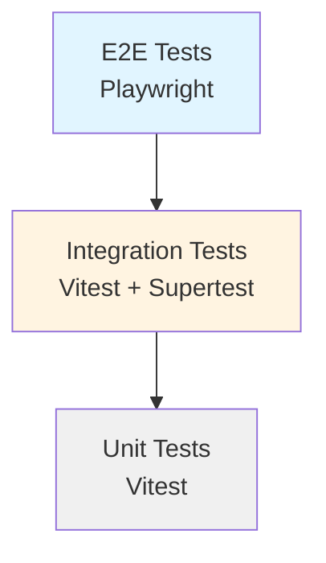

# 测试文档

## 📋 目录

- [概述](#概述)
- [测试架构](#测试架构)
- [环境设置](#环境设置)
- [运行测试](#运行测试)
- [测试编写指南](#测试编写指南)
- [最佳实践](#最佳实践)
- [CI/CD 集成](#cicd-集成)
- [故障排查](#故障排查)

---

## 概述

本项目采用分层测试策略，包含三层测试：

| 测试类型     | 框架               | 用途                        | 运行频率  |
| ------------ | ------------------ | --------------------------- | --------- |
| **单元测试** | Vitest             | 组件、Hook、Store、工具函数 | 每次提交  |
| **集成测试** | Vitest + Supertest | API 端点、服务层            | 每次提交  |
| **E2E 测试** | Playwright         | 用户完整流程、跨浏览器      | PR 合并前 |

---

## 测试架构

### 目录结构

```
tests/
├── e2e/                          # E2E 测试（Playwright）
│   └── skill-browsing.spec.ts    # Skill 浏览功能测试
├── integration/                  # 集成测试（Vitest）
│   └── api/                      # API 集成测试
│       └── skills.test.ts        # Skill API 测试
├── support/                      # 测试支持文件
│   ├── fixtures/                 # 测试夹具
│   │   ├── index.ts              # 夹具索引 + mergeTests
│   │   └── factories.ts          # Faker 数据工厂
│   ├── helpers/                  # 测试辅助工具
│   │   └── index.ts              # 通用辅助函数
│   └── page-objects/             # 页面对象模型
│       ├── SkillCard.ts          # Skill 卡片页面对象
│       └── SkillBrowsePage.ts    # Skill 浏览页页面对象
├── unit/                         # 单元测试（Vitest）
│   ├── components/               # React 组件测试
│   ├── hooks/                    # Hook 测试
│   └── stores/                   # Zustand Store 测试
└── setup.ts                      # 测试环境设置
```

### 测试分层策略



**测试金字塔原则：**

- 单元测试：数量最多，运行最快
- 集成测试：数量适中，验证模块交互
- E2E 测试：数量最少，覆盖关键用户流程

---

## 环境设置

### 前置要求

- Node.js 18+ (推荐使用 `.nvmrc` 中指定的版本)
- npm 或 pnpm

### 安装依赖

```bash
# 安装项目依赖
npm install

# 安装 Playwright 浏览器（首次运行 E2E 测试前）
npx playwright install
```

### 环境变量

创建 `.env.test` 文件（可选）：

```env
# 测试环境配置
TEST_ENV=true
BASE_URL=http://localhost:5173
API_URL=http://localhost:3001
```

---

## 运行测试

### 单元测试

```bash
# 运行所有单元测试
npm run test

# 运行单元测试（监听模式）
npm run test:run

# 运行单元测试（带覆盖率）
npm run test:coverage
```

### E2E 测试

```bash
# 运行所有 E2E 测试（无头模式）
npm run test:e2e

# 运行 E2E 测试（UI 模式，推荐开发时使用）
npm run test:e2e:ui

# 运行特定浏览器
npx playwright test --project=chromium
npx playwright test --project=firefox
npx playwright test --project=webkit

# 运行特定测试文件
npx playwright test tests/e2e/skill-browsing.spec.ts

# 调试模式（逐步执行）
npx playwright test --debug

# 查看测试报告
npx playwright show-report
```

### 集成测试

```bash
# 集成测试通过 Vitest 运行
npm run test tests/integration

# 或者运行所有测试
npm run test:run
```

### 所有测试

```bash
# 运行单元 + 集成测试
npm run test:run

# 运行 E2E 测试
npm run test:e2e

# 生成覆盖率报告
npm run test:coverage
```

---

## 测试编写指南

### 单元测试示例

```typescript
import { describe, it, expect } from 'vitest';
import { render, screen } from '@testing-library/react';
import { SkillCard } from '@/components/skills/SkillCard';

describe('SkillCard', () => {
  it('应该显示 Skill 名称和描述', () => {
    const skill = createSkillMeta();
    render(<SkillCard skill={skill} />);

    expect(screen.getByText(skill.name)).toBeInTheDocument();
    expect(screen.getByText(skill.description)).toBeInTheDocument();
  });
});
```

### E2E 测试示例

```typescript
import { test, expect } from "../support/fixtures";
import { SkillBrowsePageObject } from "../support/page-objects";

test("应该能够搜索 Skill", async ({ page }) => {
  // Given: 用户在首页
  const browsePage = new SkillBrowsePageObject(page);
  await browsePage.navigate();

  // When: 用户搜索关键词
  await browsePage.search("review");

  // Then: 应该显示匹配的 Skill
  const count = await browsePage.getSkillCardCount();
  expect(count).toBeGreaterThan(0);
});
```

### 集成测试示例

```typescript
import { describe, it, expect } from "vitest";
import request from "supertest";
import app from "../../server/app";

describe("GET /api/skills", () => {
  it("应该返回 Skill 列表", async () => {
    const response = await request(app).get("/api/skills");

    expect(response.status).toBe(200);
    expect(response.body.success).toBe(true);
    expect(Array.isArray(response.body.data)).toBe(true);
  });
});
```

---

## 最佳实践

### 1. 选择器策略

**优先使用 `data-testid` 属性：**

```typescript
// ✅ 推荐
await page.click('[data-testid="skill-card"]');
await page.fill('[data-testid="search-input"]', "query");

// ❌ 避免
await page.click(".skill-card"); // 依赖 CSS 类名，易变化
await page.click("div > div > button"); // 依赖 DOM 结构，脆弱
```

### 2. 测试隔离

**每个测试应该独立，不依赖其他测试的状态：**

```typescript
test.beforeEach(async ({ page }) => {
  // 清理状态
  await page.goto("/");
  await clearLocalStorage(page);
});

test("测试 A", async ({ page }) => {
  // 测试 A 的逻辑，不影响测试 B
});

test("测试 B", async ({ page }) => {
  // 测试 B 的逻辑，不依赖测试 A
});
```

### 3. 使用数据工厂

**使用 Faker 生成随机测试数据，避免硬编码：**

```typescript
import { createSkillMeta, createCategory } from "../support/fixtures/factories";

test("创建 Skill", async ({ page }) => {
  const skill = createSkillMeta({
    name: "Custom Name", // 可以覆盖特定字段
  });
  // 使用 skill 数据...
});
```

### 4. 页面对象模式

**封装页面交互，提高可维护性：**

```typescript
// ✅ 使用页面对象
const browsePage = new SkillBrowsePageObject(page);
await browsePage.search("query");
await browsePage.selectCategory("coding");

// ❌ 直接操作页面
await page.fill('[data-testid="search-input"]', "query");
await page.click('[data-testid="category-coding"]');
```

### 5. 等待策略

**使用显式等待，避免魔法延迟：**

```typescript
// ✅ 显式等待
await expect(page.locator('[data-testid="skill-card"]')).toBeVisible();
await page.waitForSelector('[data-testid="preview-panel"]');

// ❌ 魔法延迟
await page.waitForTimeout(1000); // 为什么是 1 秒？
```

### 6. 断言最佳实践

**使用语义化的断言：**

```typescript
// ✅ 语义化断言
await expect(skillCard).toBeVisible();
await expect(skillCard).toHaveText("Expected Text");

// ❌ 不推荐的断言
const isVisible = await skillCard.isVisible();
expect(isVisible).toBe(true); // 不必要的中介变量
```

---

## CI/CD 集成

### GitHub Actions 配置示例

```yaml
name: Tests

on: [push, pull_request]

jobs:
  unit-tests:
    runs-on: ubuntu-latest
    steps:
      - uses: actions/checkout@v4
      - uses: actions/setup-node@v4
        with:
          node-version: "20"
          cache: "npm"
      - run: npm ci
      - run: npm run test:run
      - run: npm run test:coverage

  e2e-tests:
    runs-on: ubuntu-latest
    steps:
      - uses: actions/checkout@v4
      - uses: actions/setup-node@v4
        with:
          node-version: "20"
          cache: "npm"
      - run: npm ci
      - run: npx playwright install --with-deps
      - run: npm run test:e2e
      - uses: actions/upload-artifact@v4
        if: always()
        with:
          name: playwright-report
          path: playwright-report/
          retention-days: 30
```

### 测试报告

**单元测试覆盖率报告：**

- 位置：`coverage/index.html`
- 查看：运行 `npm run test:coverage` 后打开浏览器

**E2E 测试报告：**

- 位置：`playwright-report/index.html`
- 查看：运行 `npx playwright show-report`

---

## 故障排查

### 常见问题

#### 1. Playwright 浏览器未安装

```bash
# 错误信息
Error: Executable doesn't exist at ...

# 解决方法
npx playwright install
```

#### 2. 端口被占用

```bash
# 错误信息
Error: listen EADDRINUSE: address already in use :::5173

# 解决方法
# 查找并杀死占用端口的进程
lsof -ti:5173 | xargs kill -9
```

#### 3. 测试超时

```typescript
// 在 playwright.config.ts 中调整超时设置
export default defineConfig({
  timeout: 60000, // 测试超时（毫秒）
  expect: {
    timeout: 10000, // 断言超时
  },
});
```

#### 4. 元素未找到

```typescript
// 使用调试工具检查选择器
await page.pause(); // 打开 Playwright Inspector

// 或使用 trace 查看
await page.context().tracing.start({ screenshots: true, snapshots: true });
// ... 执行测试 ...
await page.context().tracing.stop({ path: "trace.zip" });
```

### 调试技巧

```typescript
// 1. 使用 page.pause() 交互式调试
await page.pause();

// 2. 截图调试
await page.screenshot({ path: "debug.png" });

// 3. 控制台日志
page.on("console", (msg) => console.log("PAGE LOG:", msg.text()));

// 4. 查看页面内容
console.log(await page.content());
```

---

## 相关资源

- [Vitest 官方文档](https://vitest.dev/)
- [Playwright 官方文档](https://playwright.dev/)
- [Testing Library 文档](https://testing-library.com/docs/react-testing-library/intro/)
- [Supertest 文档](https://github.com/visionmedia/supertest)

---

## 联系与支持

如有测试相关问题，请：

1. 查阅本文档
2. 查看现有测试示例
3. 联系团队成员

**Happy Testing! 🎉**
